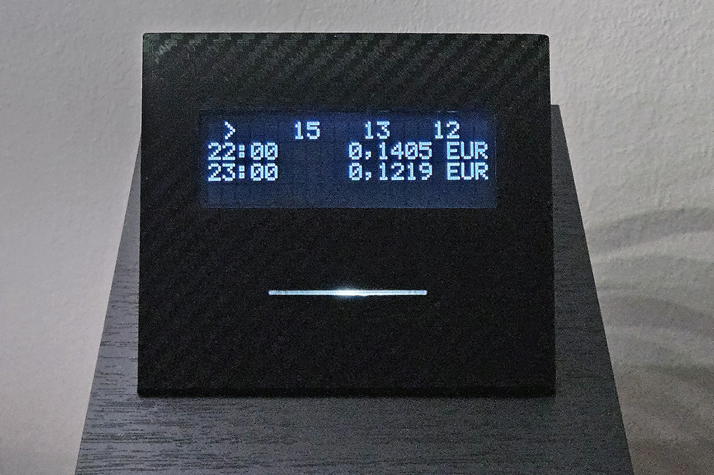

# Electricity Price Ticker for XIAO ESP32‑C3 (Energy‑Charts)

This project is an Arduino‑IDE‑friendly firmware for the **Seeed XIAO ESP32‑C3** that:

- Connects to Wi‑Fi.
- Fetches **day‑ahead electricity prices** from [Energy‑Charts.info](https://energy-charts.info).
- Computes final consumer prices (including configurable power‑company fee + VAT).
- Displays current and upcoming prices on a **20x4 I²C 2004 LCD**.
- Uses a white LED and an optional presence sensor to give quick visual feedback.
- Stores daily price data in **NVS** to survive reboots and reduce API calls.

The latest sketch implements **Version 7.1** with separate provider fee support for negative spot prices.

---

## Version Highlights

### v7.1 - Negative Price Provider Fee (2026-04-06)

Added a separate configurable provider fee for negative spot prices, correctly
modelling contracts where the provider's fee structure differs between positive
and negative market prices.

**New constant:**
```cpp
const float NEG_PRICE_COMPANY_FEE_PERCENTAGE = 30.0;
```

**Price calculation is now:**

| Market price | Formula |
|---|---|
| Positive (`raw >= 0`) | `raw × (1 + POWER_COMPANY_FEE_PERCENTAGE/100) × (1 + VAT_PERCENTAGE/100)` |
| Negative (`raw < 0`) | `raw × (1 - NEG_PRICE_COMPANY_FEE_PERCENTAGE/100) × (1 + VAT_PERCENTAGE/100)` |

The switch happens on the **raw API price** before any multiplier is applied.
VAT is applied to both cases, consistent with net billing contracts where VAT
is calculated on the monthly net sum (mathematically equivalent due to VAT
being a linear multiplier).

**Key values for `NEG_PRICE_COMPANY_FEE_PERCENTAGE`:**

| Value | Meaning |
|---|---|
| `30.0` | Provider keeps 30%, pays you 70% of the negative market price |
| `0.0` | Provider passes the full negative price to you (no fee deducted) |

All 5 fee calculation sites updated: `updateLeds()`, `format15MinPrice()`,
`displayPriceRow()`, `displaySecondaryList()` (daily average), and version strings.

---

### v7.0 - Rolling 48-Hour Logic & Midnight Bridge (Major Upgrade)

This version is the **"Golden Build"** for this hardware platform. It combines all hardware stability fixes from v6.2.4 with a revolutionary new 48-hour price prediction system.

#### Key New Features

- **Midnight Bridge**: Instantly promotes pre-fetched tomorrow's data to become today's data at midnight, eliminating the "1 AM fetch gap"
- **Dual-Buffer NVS**: Stores "Today" and "Tomorrow" data independently
- **47-Hour Scrolling**: View up to 47 hours of price data when tomorrow's data is available
- **Visual Tomorrow Indicators**: Future hours are marked with `HH:>>` format
- **Smart Fetching**: Automatically fetches tomorrow's data after 14:00 (2 PM)

#### Technical Highlights

- **Instant Midnight Transition**: No more "No Data" screen at midnight
- **Power-Failure Resilience**: New day's data is saved to NVS immediately after midnight swap
- **Correct Min/Max for Tomorrow**: Price indicators correctly reference tomorrow's statistics
- **LED Indicators Pinned to Current**: White LED always reflects actual current prices

### v6.2.4 - Exact-boundary display refresh bug (critical fix of v6.2.3 update)
- Problem: At the exact top of the hour (e.g., 20:00:00), the display automatically refreshed but showed the PREVIOUS hour's data (19:00). This happened because the "next-boundary" rounding logic in findCurrentPriceIndex() pre-calculated the next boundary.
- Fix: Simplified findCurrentPriceIndex() to use a robust "last entry <= now" comparison. This ensures the display transitions to the new hour instantaneously at XX:00:00.

### v6.2.3 - State-based display refresh logic (critical fix of v6.2.2 update)
- Problem: Screen would occasionally fail to update if the ESP32 was busy (fetching data or reconnecting WiFi) during the exact 00/15/30/45 minute mark.
- Fix: Switched from "Event-Based" (refresh only AT minute X) to "State-Based" (refresh IF current time != last refresh time). This ensures the screen updates immediately even if the device was busy during the transition.

### v6.2.2 - Display Blank Lines Issue Fix (critical fix of v6.2.1 update)
  - Problem: Sometimes rows 0 and 1 (current 15-min prices and current hour) were blank.
  - Cause: The "hour suppression" logic was hiding the current hour unexpectedly.
  - Fix:
    - Row 1 (current hour) now ALWAYS shows - suppression logic only applies to rows 2-3.
    - Row 0 (15-min details) also always shows for the current hour.

### v6.2.1 – Current Interval Fix (critical fix of v6.2.0 update)
- Fixed display showing prices one hour ahead of the current time.
- `findCurrentPriceIndex()` now correctly returns the current 15-minute interval.

Major update sketch implements **Version 6.2.0**, focusing on:

- **Version 6.2.0 FIX**: **DST (Daylight Saving Time) handling fully fixed** – the ticker now works correctly on ALL days including DST switch days (spring forward and fall back). Uses timestamp-based lookups throughout.
- Version 6.1.2 fix: restore correct **white LED indicator** behavior (ESP32 PWM fix; no dim glow when off).
- Version 6.1.1 fix: Correct daily **low/high hourly markers** (now includes negative and **0.0** prices).
- Daily (not hourly) API fetching.
- Robust **NVS storage** of daily price data.
- Correct **CET/CEST** handling.
- Resilient **after‑midnight refresh** (no more getting stuck on "No data for today").
- Preserved UI and button behavior from v5.5.

---

## DST (Daylight Saving Time) – How It Works

### v6.2.0+: Fully DST-Safe

**Important**: Starting with v6.2.0, the ticker is **fully DST-safe** and requires **no manual intervention** on DST switch days.

The firmware uses **timestamp-based price lookups** that work correctly regardless of whether the day has 23, 24, or 25 hours:

| Day Type | Hours in Day | Price Entries | Status |
|----------|-------------|---------------|--------|
| Normal | 24 | 96 | Works |
| Spring forward (March) | 23 | 92 | Works (fixed in v6.2.0) |
| Fall back (October) | 25 | 100 | Works (fixed in v6.2.0) |

### Timezone Configuration

The firmware uses the `TZ_CET_CEST` timezone string for displaying local time:

```cpp
const char* TZ_CET_CEST = "CET-1CEST,M3.5.0/02:00,M10.5.0/03:00";
```

**Current behavior:**
- Spring forward: Last Sunday of March at 02:00 → 03:00 (CEST, UTC+2)
- Fall back: Last Sunday of October at 03:00 → 02:00 (CET, UTC+1)

### Future-Proof: If EU Cancels DST

If the EU parliament ever cancels DST switching, you only need to update **one line of code**:

```cpp
// Option A - Stay on CET (UTC+1, winter time) permanently:
const char* TZ_CET_CEST = "CET-1";

// Option B - Stay on CEST (UTC+2, summer time) permanently:
const char* TZ_CET_CEST = "CEST-2";
```

The rest of the code works unchanged because it uses timestamp-based lookups.

---

## The Midnight Bridge (v7.0)

### The Problem with Traditional Tickers

Most electricity tickers fail at midnight because they rely on slow API calls to fetch new data. The Energy-Charts API typically doesn't publish next-day data until 1-2 AM, leaving users with a "No Data" screen for hours.

### The Solution: Midnight Bridge

The Midnight Bridge detects the moment the local clock moves from 23:59:59 to 00:00:00 and instantly promotes the pre-fetched "Tomorrow" data to become "Today" data.

**How it works:**

1. **Pre-fetching**: After 14:00 (2 PM), the ticker automatically fetches tomorrow's prices using the `&start=YYYY-MM-DD` API parameter
2. **Buffer Storage**: Tomorrow's data is stored in a separate NVS slot (`data_prc_t`)
3. **Midnight Detection**: The main loop detects day rollover by comparing `tm_mday`
4. **Instant Swap**: At 00:00:00, tomorrow's buffer instantly becomes today's data
5. **NVS Persistence**: New day's data is saved immediately after swap (power-failure protection)

### Power-Failure Protection

Immediately after the midnight swap, the new "Today" data is serialized and saved to NVS. If power is cut at 00:05 AM, the device reboots with correct data already loaded.

---

## Dual-Buffer System (v7.0)

The v7.0 firmware implements a dual-buffer system that stores today and tomorrow data independently:

### Buffer Comparison

| Buffer | Variable | NVS Keys | Contents |
|--------|----------|----------|----------|
| Today | `doc` | `data_prc`, `data_day`, `data_mon`, `data_year` | Current day's prices |
| Tomorrow | `docTomorrow` | `data_prc_t`, `data_store_t` | Next day's prices |

### Statistics Per Buffer

Each buffer maintains its own statistics:
- **Daily average**: `averagePrice` / `averagePriceTomorrow`
- **Lowest price index**: `lowestPriceIndex` / `lowestPriceIndexTomorrow`
- **Highest price index**: `highestPriceIndex` / `highestPriceIndexTomorrow`

### Display Selection

The display logic automatically selects the correct buffer based on the time offset:

```cpp
bool showTomorrow = (totalHourOffset >= 24);
StaticJsonDocument<Config::JSON_BUFFER_SIZE>& targetDoc = showTomorrow ? docTomorrow : doc;
int lowIdx = showTomorrow ? lowestPriceIndexTomorrow : lowestPriceIndex;
```

---

## 48-Hour Scrolling (v7.0)

### Extended Range

When tomorrow's data is available, users can scroll up to **47 hours ahead**:

```cpp
int maxOffsetLimit = isTomorrowDataAvailable ? 47 : 23;
```

### Visual Tomorrow Indication

Future hours (tomorrow) are displayed with `HH:>>` format to clearly distinguish them from today's hours:

```
Today's hour:  14:00 | Tomorrow's hour: 14:>>
```

### Correct Min/Max Indicators

The low/high price markers (arrows) correctly reference tomorrow's statistics when viewing tomorrow's hours:

```cpp
if (dataIndex == lowIdx) {
    lcd.write(byte(3)); // Low price arrow
}
```

---

## Behavior & Display States (v7.1)

The display changes based on which data buffer is being used and the status of the fetch:

| **State** | **Display Output** | **LED Behavior** |
|----------|-------------------|-----------------|
| **Normal (Today)** | Shows current prices and 15-min details. Hours are marked as HH:00. | White LED reflects current price status (Breathe, Solid, or Blink). |
| **Scrolling (Tomorrow)** | Future prices are displayed. Hours are marked with HH:>> to indicate "Tomorrow". | **Pinned to Today:** The LEDs continue showing the _actual current_ price status even while browsing future hours. |
| **No Data** | Displays: "No data for today, Press & hold to, refresh manually." | White LED is turned **OFF** to avoid misleading price signals. |
| **Connecting** | "Elec. Rate SI v7.1" followed by "Connecting..." and progress dots. | Built-in LED is **OFF** until connection is established. |

### Key UX Principle: LEDs Stay Pinned to Current Time

Unlike the display which can scroll through future hours, the white LED **always** reflects the actual current price status. This means:
- Even while browsing tomorrow's cheap hours, the LED tells you the **true current** price situation
- This prevents confusion and helps you decide "should I turn on the dishwasher **now**?"

---

## API Call Intervals & Retry Strategy (v7.0)

### Primary Scheduling (Daily Fetch)

The device aims to maintain a rolling 48-hour data window by fetching today's and tomorrow's data at specific times:

- **Initial Boot:** An API call is attempted immediately upon startup and time synchronization.
- **Tomorrow's Data (Smart Fetching):** Starting at **14:00 (2 PM) local time**, the device begins checking for the next day's prices. It will attempt to fetch this data periodically until successful.
- **Midnight Rollover:** At exactly **00:00:00**, the device "promotes" tomorrow's data to the today buffer. If tomorrow's data was already successfully fetched and stored, **no API call is needed at midnight**.

### Retry Logic (Exponential Backoff)

If a scheduled API call fails (e.g., due to a temporary server error or WiFi glitch), the device uses a safety-oriented retry interval:

- **Max Retries:** 5 attempts (`HTTP_GET_RETRY_MAX = 5`)
- **Backoff Factor:** 2 (`HTTP_GET_BACKOFF_FACTOR = 2`)
- **Typical Progression:** After a failure, it waits a short period, then doubles that wait time for each subsequent failure until the maximum retry count is reached

### "Midnight Phase" Recovery

If the device reaches midnight but **does not** have tomorrow's data ready (meaning the afternoon fetches failed), it enters a high-priority state called `midnightPhaseActive`:

- **Behavior:** Bypasses the standard daily schedule and retries the API **more aggressively**
- **Initial Interval:** Attempts every minute until successful
- **Goal:** Clear the "No Data" screen and restore the price display as quickly as possible once the energy provider's server updates

### Background Monitoring

While not making API calls constantly, the device performs these checks continuously:

- **Loop Pacing:** The main system loop runs every **100ms** to check if it's time for a scheduled fetch
- **Display Refresh:** The screen logic checks the time every loop but only refreshes the UI every **15 minutes** (at :00, :15, :30, :45) to match the price data intervals

---

## Bidding Zones (BZN) / Region Selection

The firmware currently uses:

```text
https://api.energy-charts.info/price?bzn=SI
```

Where `bzn` is the **bidding zone** code. You can change this in the `.ino`:

```cpp
const char* api_url = "https://api.energy-charts.info/price?bzn=SI";
```

to any supported BZN.

All available bidding zones:

- `AT` ‑ Austria
- `BE` ‑ Belgium
- `BG` ‑ Bulgaria
- `CH` ‑ Switzerland
- `CZ` ‑ Czech Republic
- `DE-LU` ‑ Germany, Luxembourg
- `DE-AT-LU` ‑ Germany, Austria, Luxembourg
- `DK1` ‑ Denmark 1
- `DK2` ‑ Denmark 2
- `EE` ‑ Estonia
- `ES` ‑ Spain
- `FI` ‑ Finland
- `FR` ‑ France
- `GR` ‑ Greece
- `HR` ‑ Croatia
- `HU` ‑ Hungary
- `IT-Calabria` ‑ Italy Calabria
- `IT-Centre-North` ‑ Italy Centre North
- `IT-Centre-South` ‑ Italy Centre South
- `IT-North` ‑ Italy North
- `IT-SACOAC` ‑ Italy Sardinia Corsica AC
- `IT-SACODC` ‑ Italy Sardinia Corsica DC
- `IT-Sardinia` ‑ Italy Sardinia
- `IT-Sicily` ‑ Italy Sicily
- `IT-South` ‑ Italy South
- `LT` ‑ Lithuania
- `LV` ‑ Latvia
- `ME` ‑ Montenegro
- `NL` ‑ Netherlands
- `NO1` ‑ Norway 1
- `NO2` ‑ Norway 2
- `NO2NSL` ‑ Norway North Sea Link
- `NO3` ‑ Norway 3
- `NO4` ‑ Norway 4
- `NO5` ‑ Norway 5
- `PL` ‑ Poland
- `PT` ‑ Portugal
- `RO` ‑ Romania
- `RS` ‑ Serbia
- `SE1` ‑ Sweden 1
- `SE2` ‑ Sweden 2
- `SE3` ‑ Sweden 3
- `SE4` ‑ Sweden 4
- `SI` ‑ Slovenia
- `SK` ‑ Slovakia

> Always verify up‑to‑date BZN support in the Energy‑Charts API docs.

---

## Hardware Setup (Detailed)

This section merges the original v5.5 instructions with the current v7.1 hardware expectations.
Follow it carefully to reproduce the working setup.

### 1. Microcontroller

- **Seeed XIAO ESP32‑C3**

Typical pins used in the sketch:

- `GPIO 5`  → white LED (`whiteLedPin`)
- `GPIO 21` → built‑in LED (`builtinLedPin`)
- `GPIO 4`  → user button / touch input (`buttonPin`)
- `GPIO 9`  → presence sensor (`presencePin`)
- I²C pins  → board‑default SDA/SCL (check XIAO ESP32‑C3 pinout)

---

### 2. 20x4 I²C LCD (2004) – PCF8574 Backpack

- LCD: **20x4 2004 character display** with I²C backpack (PCF8574 or compatible).
- Default I²C address (in code): `0x27`
  (Change in the sketch if your module differs: `LiquidCrystal_I2C lcd(0x27, 20, 4);`)

**Connections:**

| LCD Backpack | XIAO ESP32‑C3 |
|-------------|---------------|
| VCC | 5V |
| GND | GND |
| SDA | I²C SDA |
| SCL | I²C SCL |

> Note: On many XIAO ESP32‑C3 board definitions, SDA/SCL are mapped internally. Just use the default I²C pins as documented by Seeed.

---

### 3. Pushbutton (Default) / Capacitive Touch Alternative

The firmware assumes a **momentary pushbutton** on `GPIO 4` by default.

#### Mechanical Pushbutton (default config)

- One leg → `GPIO 4`
- Other leg → `GND`
- No external pull‑up is required; code uses:

```cpp
pinMode(buttonPin, INPUT_PULLUP);
```

And reads the button as **active‑LOW**:

```cpp
int reading = !digitalRead(buttonPin);
```

So:

- Button **pressed** ⇒ `reading == 1`
- Button **released** ⇒ `reading == 0`

#### Alternative: TTP223 Capacitive Touch Button

If you prefer a TTP223 capacitive touch input instead of a mechanical button:

**Wiring:**

- `VCC` → **3.3V**
- `GND` → **GND**
- `OUT` → `GPIO 4` (same as the pushbutton pin)

**Logic:**

- TTP223 output is **HIGH when touched**.

If you use TTP223, you may want to **remove the logical inversion** in the code:

```cpp
// For mechanical button (active LOW):
int reading = !digitalRead(buttonPin);

// For TTP223 (active HIGH), change to:
int reading = digitalRead(buttonPin);
```

Everything else (debounce, long‑press, double‑click) remains compatible.

---

### 4. Presence Sensor (RCWL‑0516, optional but supported)

The presence sensor is used to control LCD backlight and LEDs to save power and avoid annoying blinking when nobody is around.

Recommended module: **RCWL‑0516** microwave motion sensor.

**Wiring:**

| RCWL‑0516 | Connection |
|-----------|------------|
| VCC | 3.3V |
| GND | GND |
| OUT | GPIO 9 (`presencePin`) |
| **Required**: 10kΩ pull‑down | Between GPIO 9 and GND |

Characteristics:

- The module can be hidden behind non‑metallic surfaces.
- Firmware automatically detects if the presence sensor is connected at boot:
  - If **detected**:
    - Presence toggles backlight on and enables LED output.
    - Absence for `backlightOffDelay` (default 30 s) turns the backlight off and disables LED output.
  - If **not detected**:
    - Backlight is kept on permanently.
    - LEDs are allowed to operate normally.

---

### 5. White LED / LED Strip Output

The sketch uses a **white LED** (or LED strip control line) on `GPIO 5` (`whiteLedPin`).

**Basic single LED wiring:**

- `GPIO 5` → series resistor (e.g. 220–470 Ω) → LED anode
- LED cathode → GND

**For LED strips or higher currents:**

- Use a suitable NPN transistor / MOSFET:

  - GPIO 5 → gate/base (with proper gate/base resistor)
  - LED strip or load → external supply (with common GND)
  - Transistor sink/source → GND / load as per standard MOSFET wiring

- Ensure the **strip power supply shares ground** with the ESP32‑C3 board.
- Do **not** drive large loads directly from the GPIO pin.

The LED is driven with various patterns to indicate price level; see "LED Price Signalling" below.

---

### 6. Power

- XIAO ESP32‑C3:
  - Via USB‑C (recommended for development).
  - Or via 5V pin if you have a regulated 5V supply (check Seeed docs).
- Ensure **all modules** (LCD, presence sensor, LED driver) share a **common ground** with the XIAO.

---

## Firmware Features (v7.1)

### Core Display & Pricing

- Data source: `https://api.energy-charts.info/price?bzn=SI`
- Resolution: 15‑minute intervals with hourly averages
- Display shows up to **47 hours** of price data (when tomorrow's data is available)
  - **Row 0**: Current hour, four 15‑minute values
  - **Rows 1–3**: Current hour + next two hours as hourly averages
- **v7.0 Feature**: Tomorrow's hours are marked with `HH:>>` format
- Price calculation: Raw MWh → EUR/kWh with configurable surcharges
  - Three configurable constants:
    - `POWER_COMPANY_FEE_PERCENTAGE` (default `12.0` %) — fee for **positive** spot prices
    - `NEG_PRICE_COMPANY_FEE_PERCENTAGE` (default `30.0` %) — fee kept by provider on **negative** spot prices
    - `VAT_PERCENTAGE` (default `22.0` %)
  - **v7.1**: Positive and negative spot prices use independent fee multipliers:

    | Market price | Formula |
    |---|---|
    | Positive (`raw >= 0`) | `raw × (1 + POWER_COMPANY_FEE_PERCENTAGE/100) × (1 + VAT_PERCENTAGE/100)` |
    | Negative (`raw < 0`) | `raw × (1 - NEG_PRICE_COMPANY_FEE_PERCENTAGE/100) × (1 + VAT_PERCENTAGE/100)` |

- LCD:
  - `LiquidCrystal_I2C` with custom characters for:
    - Local language letters.
    - Low‑price and high‑price indicators.
- **Daily min/max markers**:
  - The low/high hourly indicators consider **negative**, **0.0**, and positive prices
  - **v7.0 Feature**: Tomorrow's min/max indices are tracked separately and displayed correctly

### LED Price Signalling

The white LED (GPIO 5) reflects the **current 15‑minute interval** price (regardless of what's displayed on screen):

| Price Level | LED Behavior |
|-------------|--------------|
| Negative / no data | LED off |
| ≤ 0.05 EUR/kWh | Smooth breathing |
| 0.05 – 0.15 | Steady on |
| 0.15 – 0.25 | Slow blink |
| 0.25 – 0.35 | Fast blink |
| 0.35 – 0.50 | Double blink |
| > 0.50 | Triple blink pattern |

**Important implementation note (from v6.1.2 on):**

- On ESP32, avoid mixing PWM (`analogWrite`) and `digitalWrite` on the same LED pin.
- The firmware now uses `analogWrite(pin, 0/255)` consistently to guarantee the LED is fully off when gated off.

LED is **disabled** when:

- No data for today.
- Time is not synced.
- Presence sensor has timed out (no presence, if installed).

### Presence Sensor & Backlight

- If presence sensor is **connected**:
  - Presence detected → LCD backlight on, LEDs enabled.
  - No presence for `backlightOffDelay` (30 s by default) → LCD backlight off, LEDs disabled.
- If **no presence sensor** is detected at boot:
  - LCD backlight is always on.
  - LEDs are not gated by presence.

### Button Behavior

One button (or touch) on GPIO 4 controls the UI:

- **Single short press**:
  - On primary screen: scrolls the time offset (future hours up to 47h in v7.0).
  - On secondary screen: scrolls through the 20‑line status text (4 lines at a time).
- **Double press**:
  - Toggles between:
    - Primary price view.
    - Secondary status/info view.
- **Long press (~3 seconds)**:
  - While held:
    - LCD shows: "Long press detected! Release to refresh".
  - On release:
    - Forces a **manual data refresh**:
      - Sets `nextScheduledFetchTime = now`.
      - Shows "Manual Refresh… Please wait…".
      - `handleDataFetching()` will perform an immediate API fetch outside the normal schedule.

An **auto‑scroll timeout** resets the view to "current hour / top of lists" after inactivity.

---

## NVS Storage (v7.0: Enhanced with Dual Buffers)

This firmware uses ESP32‑C3 **Preferences API** (`Preferences`) under namespace `"my-ticker"`.

### Stored Keys (v7.0)

**Wi‑Fi credentials:**
- `ssid`
- `pass`

**Today's price data:**
- `data_day`   – calendar day (1–31)
- `data_mon`   – month (0–11)
- `data_year`  – full year (e.g. 2026)
- `data_prc`   – full raw JSON payload from the API
- `data_last_store` – Unix time (`time_t`) when data was last written

**Tomorrow's price data (v7.0 new):**
- `data_prc_t` – full raw JSON payload for next day
- `data_store_t` – Unix time when tomorrow's data was stored

### On Boot

After successful NTP time sync:

1. Attempt to load `data_day`, `data_mon`, `data_year`, and `data_prc` from NVS.
2. If **stored date matches current local date**:
   - Deserialize `data_prc` into `StaticJsonDocument doc`.
   - Run `processJsonData(false)` as if it were fresh from the API.
   - Set `isTodayDataAvailable = true`.
   - **Skip** the initial API call to save traffic.
3. Attempt to load tomorrow's data from `data_prc_t`.
4. If the stored date does **not** match today or JSON parsing fails:
   - NVS data is **ignored** for display.
   - System starts from "No data for today".
   - Schedules an immediate API fetch.

### After Each Successful Fetch

- Today's data: Raw JSON payload is stored into NVS as `data_prc`, along with date and `data_last_store`.
- Tomorrow's data (v7.0): After 14:00, tomorrow's payload is stored as `data_prc_t` with `data_store_t`.

### Midnight Bridge NVS Update (v7.0)

At midnight rollover:
1. Tomorrow's buffer is swapped to become today's buffer
2. New "today" data is immediately serialized and saved to NVS
3. Tomorrow's NVS slot is cleared

This ensures power-failure resilience: if power is lost immediately after midnight, the device boots with valid data.

---

## Daily Fetch Strategy (v7.0: Enhanced with Smart Tomorrow Fetching)

### Goals

- **Avoid hourly polling** of the API.
- Fetch:
  - Once after boot (if no valid NVS data for today).
  - Once per **new day** (after midnight), with robust retries while the next‑day dataset is not yet published.
  - **NEW in v7.0**: Tomorrow's data automatically after 14:00 local time.

### Time Sync & First Fetch

- `configTzTime(TZ_CET_CEST, "pool.ntp.org")` is used to enable CET/CEST aware `localtime()` and `getLocalTime()`.
- Until time sync completes, the UI only shows "Syncing Time… Please wait…".
- On first successful sync:
  - `isTimeSynced = true`.
  - `trackedDay` is set to the current `tm_mday`.
  - Either NVS is used (if it has today's data) or an initial fetch is scheduled.

### Day‑Rollover Detection (v7.0: Enhanced with Midnight Bridge)

In the main `loop()`:

- `trackedDay` holds the last seen local day.
- Each iteration:
  - Get `localtime()` for `now`.
  - If `tm_mday != trackedDay`:
    - Day rollover detected (midnight).
    - `trackedDay` updated.
    - **v7.0 Midnight Bridge Logic**:
      - If tomorrow's data is available:
        - Instantly swap `docTomorrow` to `doc`
        - Update all statistics (`averagePrice`, `lowestPriceIndex`, etc.)
        - Save to NVS and clear tomorrow slot
        - Reset `timeOffsetHours` to 0
      - If tomorrow's data is NOT available:
        - Enter "No Data" mode
        - Start midnight retry phase

### Smart Tomorrow Fetching (v7.0)

After 14:00 local time, if tomorrow's data is not yet available:

```cpp
if (ti->tm_hour >= 14 && !isTomorrowDataAvailable) {
    fetchAndProcessData(true); // Fetch tomorrow's data
}
```

The API URL is constructed with the `&start=YYYY-MM-DD` parameter for the next day.

### "Today" Detection (Market Day Logic)

The Energy‑Charts API can keep serving **yesterday's** market day for some time after local midnight.
To avoid accidentally accepting yesterday's data as today's, v6.1+ uses a more robust rule.

In `processJsonData()`:

1. Read `unix_seconds[]`.
2. Interpret the **LAST** timestamp as representing the end of the dataset's market day.
3. Convert it to local time (`localtime()`).
4. Compare its date (day, month, year) to the current local date (or tomorrow's date if `isTomorrow` is true).
   - If they **match**:
     - Dataset is accepted as valid.
     - Statistics are updated for the appropriate buffer.
   - If they **do not match**:
     - Dataset is rejected.
     - Appropriate availability flag is set to false.

---

## Secondary Status Screen (Debug / Info)

A **secondary screen** (toggled via **double‑click**) provides 20 lines of status information, displayed 4 lines at a time:

Typical content (updated for v7.1):

1. Current date and time (`HH:MM  DD.MM.YYYY`)
2. Separator line (`--------------------`)
3. "Zadnja posodobitev:" (Last update header)
4. Last successful fetch (for today) date & time
5. Blank
6. "Dnevno povprečje:" (Daily average)
7. Daily average price in EUR/kWh (with surcharges) or "Cene niso na voljo."
8. Blank
9. Wi‑Fi status and RSSI
10. Local IP address
11. API success rate (`API: xx% (succ/fail)`)
12. Device uptime in days, hours, minutes
13–16. **NVS status block**:
    - `NVS status:`
    - `Data day: DD.MM.YYYY` or `Data day: none`
    - `Last save: DD.MM.YY` or `Last save: none`
    - `NVS: Today+Tomorrow` / `NVS: Today only` / `NVS: Empty/Old`
17–20. Credits and version:
    - `energy-charts.info`
    - `dynamic electricity`
    - `price ticker v7.1`
    - `by Legolas-2025`

---

## Wi‑Fi Provisioning

If NVS does not contain valid Wi‑Fi credentials, or if connecting fails repeatedly:

1. The device starts an **Access Point** with SSID:

   ```text
   MyTicker_Setup
   ```

2. LCD shows "No Wi‑Fi access! Setup Wi‑Fi: SSID: MyTicker_Setup" and the AP IP.
3. A simple captive portal is served:
   - Open any URL while connected to `MyTicker_Setup`.
   - Enter SSID and password in the HTML form.
   - Values are stored in NVS: `ssid`, `pass`.
   - Device reboots and attempts to connect with the new credentials.

---

## Building & Uploading

1. Install **Arduino IDE** with ESP32 board support (including XIAO ESP32‑C3).
2. Install required libraries:
   - `LiquidCrystal_I2C`
   - `ArduinoJson`
   - `DNSServer` (from ESP32 core)
   - `WebServer` (from ESP32 core)
   - `Preferences` (built‑in for ESP32)
3. Open the v7.1 `.ino` file (`ESP32_standalone_electricity_ticker_7_1.ino`).
4. In Tools:
   - Board: `Seeed XIAO ESP32C3`
   - Port: choose the correct serial port.
5. Upload the sketch.
6. Open Serial Monitor at **115200 baud** to see:
   - Wi‑Fi connection logs.
   - NTP sync messages.
   - NVS load/save status.
   - Midnight rollover and retry debug output.
   - Tomorrow fetch logs (`Fetching Tomorrow's Data...`)

---

## Versioning & Changelog

- **v7.1** – Negative price provider fee:
  - Separate `NEG_PRICE_COMPANY_FEE_PERCENTAGE` constant (default `30.0` %)
  - Positive prices: `raw × (1 + pos_fee) × (1 + VAT)`
  - Negative prices: `raw × (1 - neg_fee) × (1 + VAT)`
  - Switch on raw API price before any multiplier
  - All 5 fee calculation sites updated
- **v7.0** – Rolling 48-Hour Logic & Midnight Bridge:
  - Dual-buffer NVS system for today and tomorrow data
  - Midnight Bridge for seamless day rollover
  - 47-hour scrolling with `HH:>>` visual indicators
  - Smart fetching of tomorrow's data after 14:00
  - Correct min/max indicators for tomorrow's hours
  - Power-failure resilient NVS updates
- **v6.2.4** – Exact-boundary display refresh bug fix
- **v6.2.3** – State-based display refresh logic fix
- **v6.2.2** – Display blank lines issue fix
- **v6.2.1** – Current interval fix
- **v6.2.0** – DST handling fully fixed via timestamp-based lookups
- **v6.1.2** – LED indicator restored (broken in previous version):
  - Avoid mixing PWM and `digitalWrite` on the same LED pin (ESP32 LEDC behavior).
  - Ensures LED is fully off when gated off; patterns operate correctly.
- **v6.1.1** – Daily low/high marker fix:
  - Daily min/max and average now include negative and **0.0** prices.
- **v6.1.0** – Midnight fetch & "today" detection fixes:
  - Correctly detect **market day** using the last `unix_seconds` timestamp.
  - Distinguish between:
    - HTTP/JSON success, but data for **wrong day** (treated as failure).
    - Full success with accepted "today" dataset.
  - Robust midnight retry scheme:
    - Two retries every 20 minutes in the first hour (~00:20, ~00:40).
    - Then hourly retries (top‑of‑hour) until today's dataset is available.
  - Behavior on reboot and manual long‑press is unchanged, but now respects the improved "today" logic.
- **v6.0.0** – NVS storage & daily fetch:
  - Store daily price data in NVS.
  - Reduce API calls to "boot + after‑midnight".
  - Add NVS status section to secondary menu.
- **v5.5** – 15‑minute detail mode, LED based on current 15‑minute slot, improved DST handling (see file `20251027a_electricity_ticker_10_5_5_latest_DST_and_midnight_fix.ino`).

See [`CHANGELOG.md`](./CHANGELOG.md) for more details.

---

## Data attribution

Electricity price data provided by
**[Energy-Charts](https://energy-charts.info)** (Fraunhofer ISE)
via the [Energy-Charts API](https://api.energy-charts.info),
licensed under [CC BY 4.0](https://creativecommons.org/licenses/by/4.0/).

---

## License

This project is licensed under the MIT License – see the [`LICENSE`](./LICENSE) file for details.
